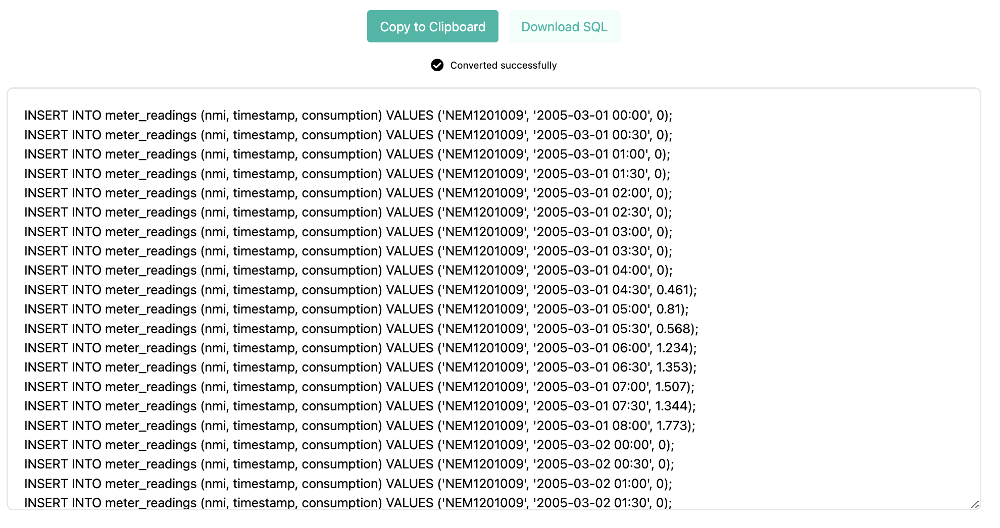

# nem12-convert
NEM12 Convert is a web application built with Next.js that facilitates the conversion of NEM12 CSV data into SQL insert files. Users can upload their NEM12 CSV files, and the application will generate SQL insert statements based on the provided data.



### Features
 - Upload NEM12 CSV
 - Generate SQL Inserts
 - Download SQL File

### Tech Stack
Next.js + React + TypeScript + Tailwind CSS + Jest

### Getting Started
 ```bash
    npm run dev
    # or
    yarn dev
    # or
    pnpm dev
    # or
    bun dev
   ```
### Testing
 ```bash
    npm run test
   ```

### Designed & structured
- Component-based structure, with separate components for file uploading, CSV parsing, SQL generation, and UI rendering. Each component is responsible for a specific functionality, promoting code organization and reusability.
- Utilizes TypeScript for static typing, providing better code documentation and enhancing developer confidence.
- Tailwind CSS Utility Classes: Leverages Tailwind CSS utility classes for styling, promoting consistency and ease of maintenance.
- Functional Programming: Embraces functional programming principles to write clean, declarative code with minimal side effects.

### Additional Improvement Suggestions
 - Node.js Backend for CSV Processing: Implement a Node.js backend to handle CSV file processing. Node.js provides efficient file I/O operations and is well-suited for tasks like parsing CSV files.
 - Testing: Increase test coverage with unit tests and integration tests to ensure code reliability and prevent regressions.
 - Performance Optimization*: Optimize code and improve performance, especially for handling large CSV files or processing complex SQL queries.


